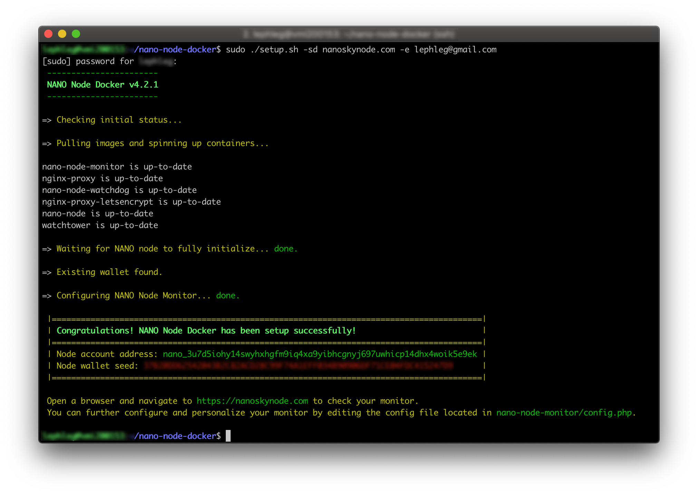

# NANO Node Docker stack

<div align="center">
    
</div>

### **Description**

This will build and deploy the following containers on your Docker host:

<table>
	<tr>
		<th width="200px">Container name</th>
		<th>Description</th>
 	</tr>
 	<tr>
   <td><b>nano-node</b></td>
   		<td>The NANO node created out of the official <a href="https://hub.docker.com/r/nanocurrency/nano/" target="_blank">NANO Docker Image</a>. RPC is enabled but <u>not</u> publicly exposed.</td>
 	</tr>
	<tr>
  		<td><b>nano-node-monitor</b></td>
   		<td>The popular NANO Node Monitor PHP application based on <a href="https://hub.docker.com/r/nanotools/nanonodemonitor/" target="_blank">NanoTools's Docker image</a>.</td>
 	</tr>
	<tr>
  		<td><b>nano-node-watchdog</b></td>
   		<td>A custom lightweight watcher container checking on node's health status every hour. Checking code adapted from <a href="https://github.com/dbachm123/nanoNodeScripts" target="_blank">dbachm123's nanoNodeScripts</a>.</td>
 	</tr>
	<tr>
  		<td><b>watchtower</b></td>
   		<td>A process watching all the other containers and automatically applying any updates to their base image. No need to manually upgrade your node anymore.</td>
 	</tr>
</table>

#### **SSL Support with Let's Encrypt**

Optionally, if a domain name is available for your host, NANO Node Docker stack can also serve your connections securely using HTTPS. If this feature is enabled (using the `-d` argument with the setup script below), the stack also includes the following containers:

<table>
	<tr>
		<th width="220px">Container name</th>
		<th>Description</th>
 	</tr>
 	<tr>
   <td><b>nginx-proxy</b></td>
   		<td>An instance of the popular Nginx web server running in a reverse proxy setup. Handles the traffic and serves as a gateway to your host.</td>
 	</tr>
	<tr>
  		<td><b>nginx-proxy-letsencrypt</b></td>
   		<td>A lightweight companion container for the nginx-proxy. It allows the creation/renewal of Let's Encrypt certificates automatically.</td>
 	</tr>
</table>

### **Quick Start**

Download the latest release, open a bash terminal and fire up the installation script:

```
$ sudo ./setup.sh -s 
```

**That's it!** You can now navigate to your host IP to check your Nano Node Monitor dashboard. **Write down** your wallet seed as it appears on the output of the installer.

#### Available command flags/arguments

The following flags are available when running the stack installer:

<table>
	<tr>
		<th width="20px">Flag</th>
<th width="180px">Argument</th>
		<th>Description</th>
 	</tr>
 	<tr>
   <td><b>-s</b></td>
   <td>-</td>
   		<td>Prints the unecrypted seed of the node wallet during the setup (in some cases you may want to avoid this for security purposes).</td>
 	</tr>
	<tr>
  		<td><b>-f</b></td>
<td>-</td>
   		<td>Enables fast-syncing by fetching the latest ledger and placing it into <i>/root/Raiblocks/</i> inside <b>nano-node</b> container.</td>
 	</tr>
	<tr>
  		<td><b>-d</b></td>
<td>your domain name</td>
   		<td>Sets the domain name to be used. Required for SSL-enabled setups.</td>
 	</tr>
	<tr>
  		<td><b>-e</b></td>
<td>your email address</td>
   		<td>Sets your email for Let's Encrypt certificate notifications. Optional for SSL-enabled setups.</td>
 	</tr>
	<tr>
  		<td><b>-q</b></td>
<td>-</td>
   		<td>Quiet mode. Hides any output</td>
 	</tr>
</table>

### Examples

#### **Install with SSL enabled**

After your DNS records are setup, fire up the installation script with the domain (-d) argument:

```
$ sudo ./setup.sh -d mydomain.com -e myemail@example.com
```

The email (-e) argument is optional and would used by Let's Encrypt to warn you of impeding certificate expiration.

**Done!** Navigate to your domain name to check your Nano Node Monitor Dashboard over HTTPS!

#### Install with fast-syncing (BETA)

NANO Node Docker stack can also bootstrap any newly created node (or an existing one) with the latest ledger files. This implies that you are willing to trust third-party sources for your node history. The latest ledger files are obtained from NANO Node Ninja link [here](https://nanonode.ninja/api/ledger/download).

Just add the `-f` flag to your installer command:

```
$ sudo ./setup.sh -f
```
**Warning: You are strongly adviced to BACKUP your wallet seed before trying to fast-sync an existing node.**

#### **Combining installer flags**

All the installer flags can be chained, so you can easily combine them like this:

```
# display seed, apply fast-sync and use Let's Encrypt with your email supplied
$ sudo ./setup.sh -sfd mydomain.com -e myemail@example.com
```

<div align="center">
    
</div>


### Self-configurable Installation

Please check the [wiki](https://github.com/lephleg/nano-node-monitor-docker-stack/wiki)
 for more detailed instructions on how to manually self-configure the NANO Node Docker Stack.

### **Credits**

* **[Nanocurrency](https://github.com/nanocurrency/raiblocks)**
* **[NANO Node Monitor](https://github.com/NanoTools/nanoNodeMonitor)**
* **[nanoNodeScripts](https://github.com/dbachm123/nanoNodeScripts)**
* **[jwilder/nginx-proxy](https://github.com/jwilder/nginx-proxy)**
* **[JrCs/docker-letsencrypt-nginx-proxy-companion](https://github.com/JrCs/docker-letsencrypt-nginx-proxy-companion)**
* **[v2tec/watchtower](https://github.com/v2tec/watchtower)**

### **Donate**

If you really liked this tool, just give this project a star so more people get to know it. Cheers! :)

You can also find my representative link on the description (but if you've followed to this repo you should already have set  yours up already!).
